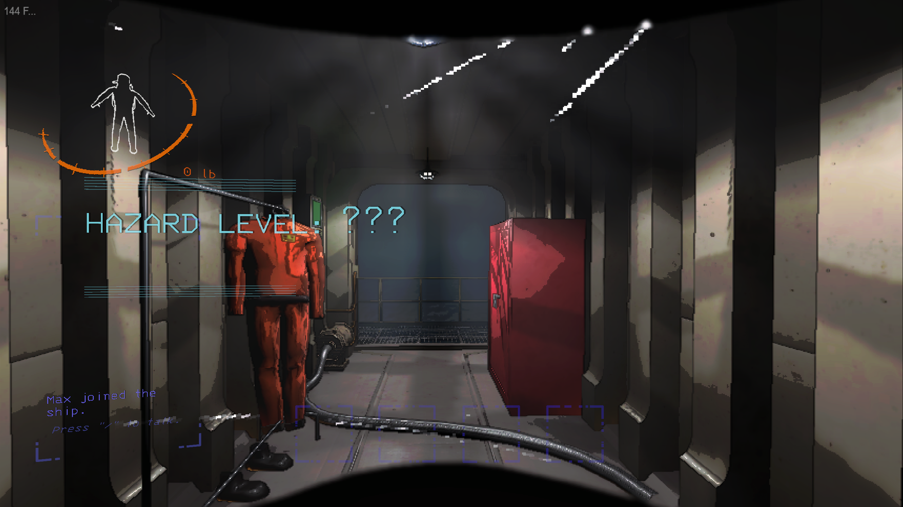

# Moon Of The Day

  

This mod adds a concept you can find in similar "run-based" games: **seeded dailies & weeklies**.

All players that use this mod will have the **exact same** moon, with the exact same weather, scrap, items, and other conditions, when they travel to the daily or weekly moon.

Note that currently, the moons and weathers are pulled from the base game (e.g. no new *content* is added - this is strictly a game mechanic mod). Any mods that add to the pool of moons, weather, scrap, and enemies *will* cause you to have a different experience than other players.

## New moons

*The company has detected some new rogue moons in the system. A temporary license has been granted to explore them.*

## Unknown danger

You won't know what you find until you actually land on these moons. However, they'll be the exact same for everyone for the duration of the day and week.

Combinations that aren't possible in the base game are possible here... *and some of them are quite deadly.*

## GitHub repository

The source code for this mod is available [here](https://github.com/MaxWasUnavailable/MoonOfTheDay). Please report bugs and suggestions there.

## Discord

For additional support, you can contact me on the [Unofficial Lethal Company Community](https://discord.gg/nYcQFEpXfU) server.
